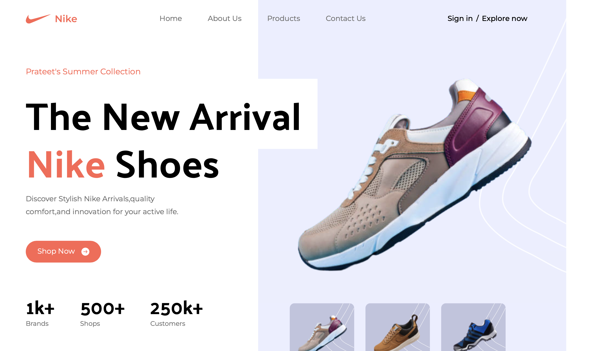

# Nike Landing Page



A modern, responsive landing page inspired by Nike's design language.

## Overview

A clean and minimal landing page showcasing Nike products with a focus on modern UI/UX principles and responsive design.

## Features

- **Responsive Design** - Works seamlessly across all devices
- **Modern UI** - Clean, minimalist Nike-inspired interface
- **Product Showcase** - Beautiful product displays
- **Smooth Animations** - Subtle transitions and effects

## Tech Stack

- React
- Tailwind CSS

## Setup

1. Clone the repository
```bash
git clone https://github.com/Prateet-Github/nike-landing-page.git
cd nike-landing-page
```

2. Install dependencies
```bash
npm install
```

3. Run the development server
```bash
npm run dev
```

4. Open `http://localhost:5173` in your browser

## License

Open source project.

---

Built with Tailwind CSS